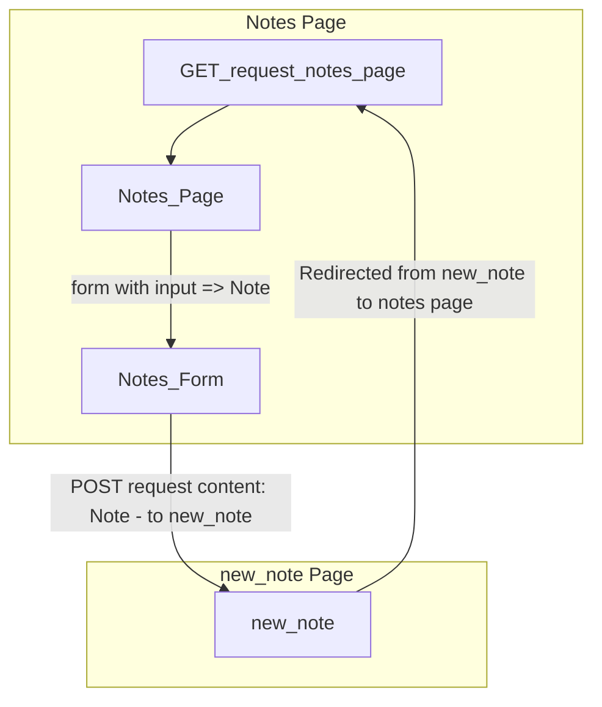

```mermaid
flowchart TB
    subgraph Notes Page
        GET_request_notes_page --> Notes_Page
        Notes_Page --  form with input => Note --> Notes_Form
    end
    subgraph new_note Page
        new_note -- Redirected from new_note to notes page -->  GET_request_notes_page
    end
    Notes_Form -- POST request content: Note - to new_note  --> new_note
```