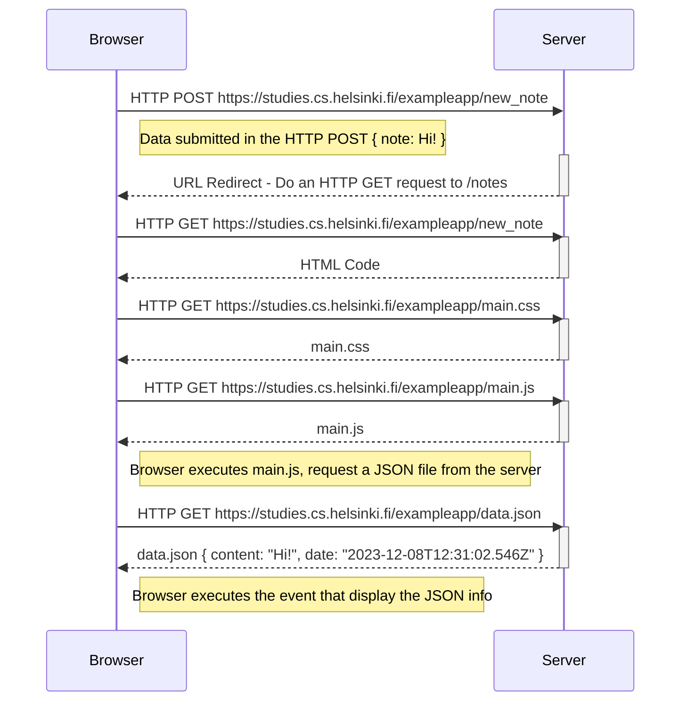

```mermaid
sequenceDiagram
    participant Browser
    participant Server
    
    Browser->>Server: HTTP POST https://studies.cs.helsinki.fi/exampleapp/new_note
    Note right of Browser: Data submitted in the HTTP POST { note: Hi! }
    activate Server
    Server-->>Browser: URL Redirect - Do an HTTP GET request to /notes
    deactivate Server
    
    Browser->>Server: HTTP GET https://studies.cs.helsinki.fi/exampleapp/new_note
    activate Server
    Server-->>Browser: HTML Code
    deactivate Server

    Browser->>Server: HTTP GET https://studies.cs.helsinki.fi/exampleapp/main.css
    activate Server
    Server-->>Browser: main.css
    deactivate Server

    Browser->>Server: HTTP GET https://studies.cs.helsinki.fi/exampleapp/main.js
    activate Server
    Server-->>Browser: main.js
    deactivate Server
    Note right of Browser: Browser executes main.js, request a JSON file from the server

    Browser->>Server: HTTP GET https://studies.cs.helsinki.fi/exampleapp/data.json
    activate Server
    Server-->>Browser: data.json { content: "Hi!", date: "2023-12-08T12:31:02.546Z" }
    deactivate Server
    Note right of Browser: Browser executes the event that display the JSON info

```