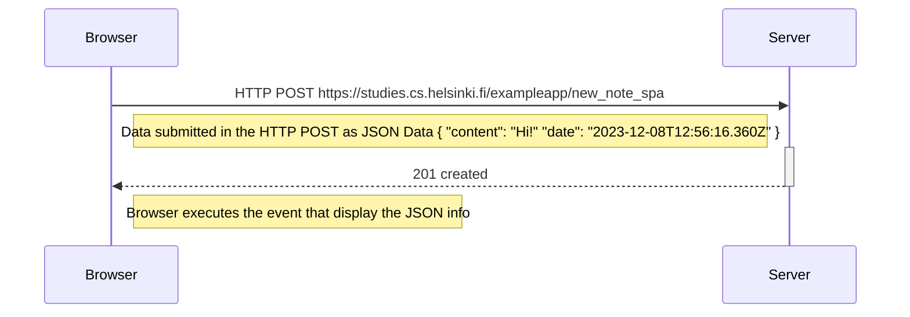

```mermaid
sequenceDiagram
    participant Browser
    participant Server
    
    Browser->>Server: HTTP POST https://studies.cs.helsinki.fi/exampleapp/new_note_spa
    Note right of Browser: Data submitted in the HTTP POST as JSON Data { "content": "Hi!" "date": "2023-12-08T12:56:16.360Z" }
    activate Server
    Server-->>Browser: 201 created
    deactivate Server
    
    Note right of Browser: Browser executes the event that display the JSON info

```